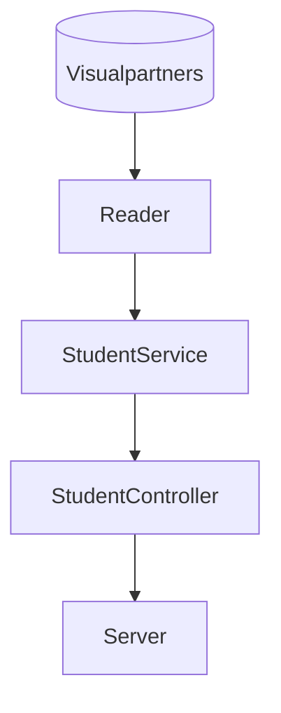
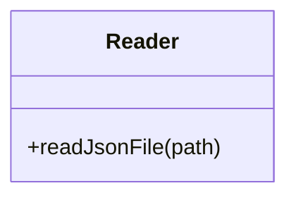
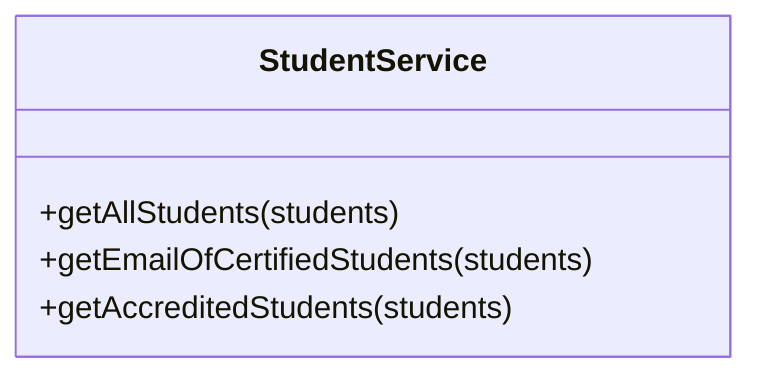
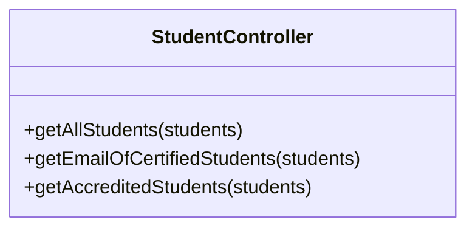

# Code Challenge

## Proyecto Backend JS Semana 4 de LaunchX

Este proyecto fue realizado por Angel David Flores Romero para Innovaccion Virtual - LaunchX

### Requerimientos

1. Habilitar un endpoint para consultar todos los estudiantes con todos sus campos.
2. Habilitar un endpoint para consultar los emails de todos los estudiantes que tengan certificación `haveCertification`.
3. Habilitar un endpoint para consultar todos los estudiantes que tengan `credits` mayor a 500.

### Dependencias Usadas

* [Jest](https://jestjs.io/docs/getting-started):JavaScript Testing Framework
* [ESlint](https://eslint.org/): Herramienta de linting
* [Express](http://expressjs.com/): Web Framework para NodeJS

### Diseño de componentes

#### Clases

`Reader `: Esta clase contiene un método static para leer un archivo mediante un path y obtener la información dado el nombre archivo.

`StudentService` : La clase tiene 3 métodos statics que realiza operaciones de filtrado y mapeo que se necesitan para cumplir con los requerimientos

`StudentController` : Esta clase tiene 3 métodos que funcionan de intermediario entre los servicios y el server haciendo operaciones como la llamada de el reader y de los servicios para retornar la información al server 

### Detalles de la API

| Endpoint                                  | Request                                   | Response                                                                                        |
| ----------------------------------------- | ----------------------------------------- | ----------------------------------------------------------------------------------------------- |
| `localhost:3000/v1/students`            | `localhost:3000/v1/students`            | Obtiene todos los campos de los estudiantes de VPS                                              |
| `localhost:3000/v1/students/emails`     | `localhost:3000/v1/students/emails`     | Obtiene los emails de los estudiantes que tengan certificación (`"haveCertification": true`) |
| `localhost:3000/v1/students/accredited` | `localhost:3000/v1/students/accredited` | Obtiene los los estudiantes que tengan `credits` mayor a 500.                                 |

## Resultados

### Endpoint 1

### Endpoint 2

### Endpoint 3

